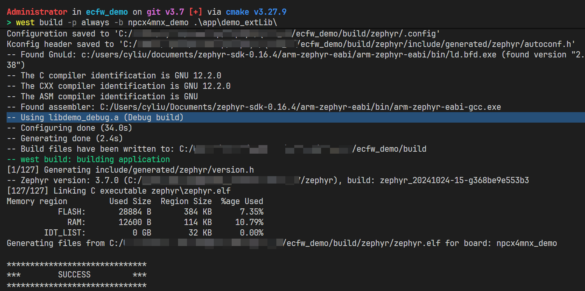
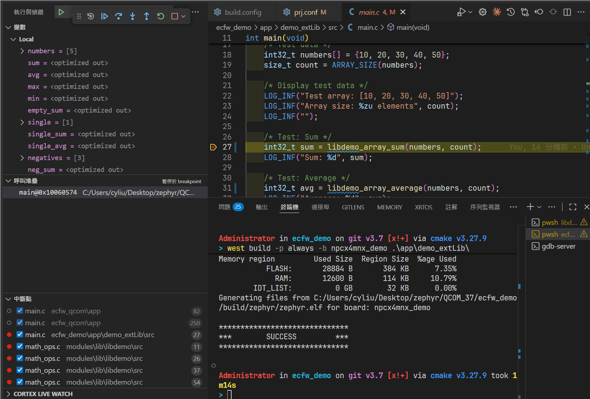
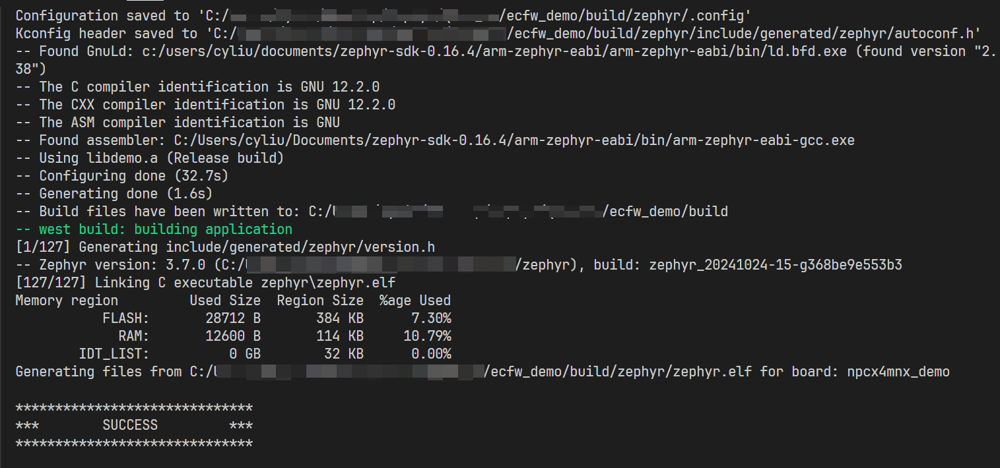
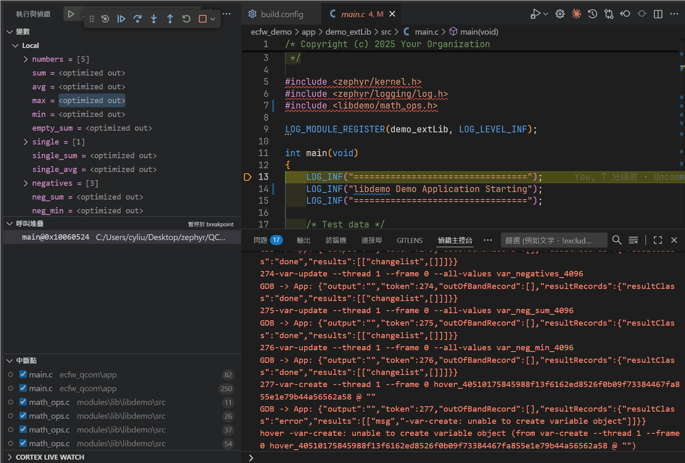

# Integration Library to DemoApp

Building external library and integrating it into Zephyr application example.

---

## Library Building

### Building Debug Library

```bash
# WSL/Linux
cd your_zephyr_project/modules/lib/libdemo
./build.sh debug

# Windows PowerShell
cd your_zephyr_project\modules\lib\libdemo
.\build.ps1 debug
```

**Output**: `modules/lib/libdemo/lib/libdemo_debug.a`


### Building Release Library

**WSL / Linux Environment**:
```bash
cd your_zephyr_project/modules/lib/libdemo
./build.sh release

# Windows PowerShell
cd your_zephyr_project\modules\lib\libdemo
.\build.ps1 release
```

**Output**: `modules/lib/libdemo/lib/libdemo.a`

## Copy Library and Header to Project

### Manual Copy

```bash
# Copy debug version
cp modules/lib/libdemo/lib/libdemo_debug.a \
   ecfw_demo/app/demo_extLib/lib/

# Copy release version
cp modules/lib/libdemo/lib/libdemo.a \
   ecfw_demo/app/demo_extLib/lib/

# Copy header file
cp -r modules/lib/libdemo/include/libdemo \
      ecfw_demo/app/demo_extLib/include/
```

### Project Library Directory Structure

```
app/demo_extLib/
├── lib/
│   ├── libdemo.a          # Release library (stripped, 1.6KB)
│   └── libdemo_debug.a    # Debug library (with symbols, 44KB)
└── include/
    └── libdemo/
        └── math_ops.h    # Library API header
```

---

## Kconfig Configuration

The project uses Kconfig to select debug or release library at build time.

### prj.conf Configuration

**Select Version**:
```conf
CONFIG_LIBDEMO_BUILD_DEBUG=y #Debug
CONFIG_LIBDEMO_BUILD_RELEASE=y #Release
```

### CMakeLists.txt Auto-linking

`CMakeLists.txt` automatically selects the correct library based on Kconfig settings:

```cmake
if(CONFIG_LIBDEMO_BUILD_DEBUG)
  target_link_libraries(app PRIVATE ${CMAKE_CURRENT_SOURCE_DIR}/lib/libdemo_debug.a)
  message(STATUS "Using libdemo_debug.a (Debug build)")
else()
  target_link_libraries(app PRIVATE ${CMAKE_CURRENT_SOURCE_DIR}/lib/libdemo.a)
  message(STATUS "Using libdemo.a (Release build)")
endif()
```

---


## Debug vs Release Comparison via vscode debug

### Debug Version (libdemo_debug.a)


Using debug version allows stepping into library source code:



### Release Version (libdemo.a)


Using release version prevents stepping into library, only assembly is visible:



---

## File Structure

```
app/demo_extLib/
├── src/
│   └── main.c              # Application main file
├── include/
│   └── libdemo/
│       └── math_ops.h      # Library API header
├── lib/
│   ├── libdemo.a            # Release library
│   └── libdemo_debug.a      # Debug library
├── CMakeLists.txt          # Build configuration
├── Kconfig                 # Kconfig
├── prj.conf                # Zephyr
└── README.md               # This document
```

